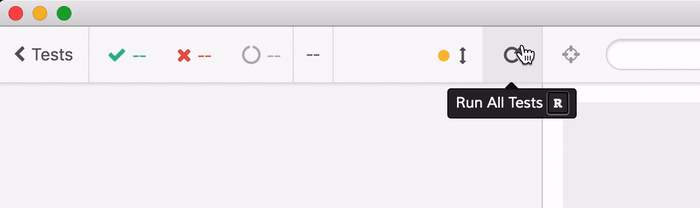
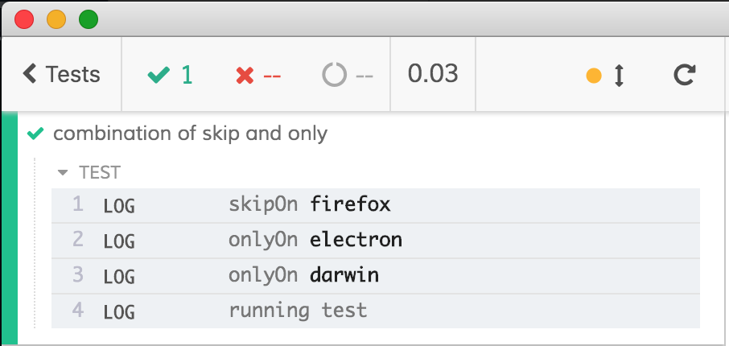
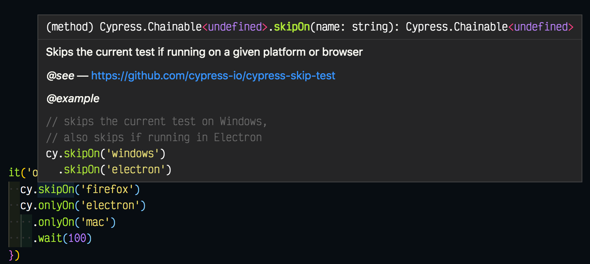

# @cypress/skip-test [![renovate-app badge][renovate-badge]][renovate-app] [![semantic-release][semantic-image] ][semantic-url] [](https://circleci.com/gh/cypress-io/cypress-skip-test/tree/master)

> Simple commands to skip a test based on platform, browser or an url

```js
it('skips this test when running on Mac', () => {
  cy.log('about to run custom command to skip this test')
    .wait(1000)
    .skipOn('mac')
})
```



## Important

This is a simple utility plugin until [Cypress supports filtering of tests](https://github.com/cypress-io/cypress/pull/5346).

## Install

```shell
npm install -D @cypress/skip-test
```

## Example

You can use this module as custom Cypress commands `cy.skipOn` and `cy.onlyOn` or by importing its functions. To use custom commands like `cy.skipOn`, add this module to your support file `cypress/support/index.js`

```js
require('@cypress/skip-test/support')
```

### `cy.skipOn`

Skip this test if running in Electron browser

```js
it('only runs on Electron', () => {
  cy.skipOn('electron')
  // the rest of the test
})
```

Skip this test if running on Windows platform

```js
it('runs on Linux and Mac', () => {
  cy.skipOn('windows')
  // the rest of the test
})
```

### `cy.onlyOn`

Continues the test only when running on Mac, skips when running on any other platform

```js
it('runs on Mac only', () => {
  cy.onlyOn('mac')
  // the rest of the test
})
```

Continues this test only when running against `localhost`. Use `baseUrl` to set the url to compare.

```js
it('only tests localhost', () => {
  cy.onlyOn('localhost')
  // the rest of the test
})
```

### imports

```js
import { onlyOn, skipOn } from '@cypress/skip-test'

it('runs only on Mac', () => {
  // using the exported function instead of
  // the custom command cy.onlyOn(...)
  onlyOn('mac')
})

it('skips on Mac', () => {
  skipOn('darwin')
})
```

### imports with callback

Instead of dynamically skipping a test at run-time, you can hide entire blocks of tests using the callback format.

```js
import { onlyOn, skipOn } from '@cypress/skip-test'
onlyOn('mac', () => {
  // this callback will only evaluate on Mac
  // thus the tests will be completely hidden from other platforms
  describe('Mac tests', () => {
    it('works', () => {})
  })
})
skipOn('mac', () => {
  // this test will run on every platform but Mac
  it('hides this test on Mac', () => {})
})
```

**Tip:** you can nest the callbacks to combine the conditions

```js
// run these group of tests only on Mac and only on Chrome
onlyOn('mac', () => {
  onlyOn('chrome', () => {
    it('works', () => {})
  })
})
```

When skipping a block of tests or a single test using browser name, it will insert a dummy empty test to let you know what has happened

```js
skipOn('firefox', () => {
  it('works', () => {...})
  it('works too', () => {...})
})
// output in the console
//  Skipping test(s) on firefox
```

### boolean flag

You can pass a boolean to each function or command if you want to calculate when to run the tests yourself.

```js
// run this test if S is "foo"
cy.onlyOn(S === 'foo')
```

You can use callback form with the flag

```js
onlyOn(S === 'foo', () => {
  describe('foo', () => {
    it('works', () => {...})
  })
})
```

You can even run other Cypress commands before deciding to skip or continue

```js
it('runs if task returns production', () => {
  cy.task('getDbName').then((name) => cy.onlyOn(name === 'production'))
  // equivalent
  cy.task('getDbName').then((name) => onlyOn(name === 'production'))
  // equivalent
  cy.task('getDbName')
    .then((name) => name === 'production')
    .then(onlyOn)
})
```

### `isOn`

You can check the condition against a browser name or an environment yourself.

```js
import { isOn } from '@cypress/skip-test'
it('loads users', () => {
  // when running on Windows locally, the backend is not running
  // thus we need to stub XHR requests
  if (isOn('windows') && isOn('localhost')) {
    cy.server()
    cy.route('/users', 'fixture:users')
  }
  cy.visit('/')
  cy.get('.user').should('have.length', 10)
})
```

### Headed

You can skip or run tests in headed / headless environments

```js
import { skipOn, onlyOn } from '@cypress/skip-test'

skipOn('headed', () => {
  it('skips the current test in headed mode', () => {
    cy.wrap(true).should('equal', true)
  })
})

onlyOn('headless', () => {
  it('runs only in headless mode', () => { ... })
})
```

**Note:** when skipping tests in this case, it will insert an empty placeholder test to provide information why the tests were skipped.

```text
- Skipping test(s), not on headed
```

### `ENVIRONMENT`

This module also reads special environment variable `ENVIRONMENT` inside its checks. For example, to only stub network calls on `staging` environment, execute the tests like this:

```shell
CYPRESS_ENVIRONMENT=staging npx cypress run
```

Inside the spec file you can write

```js
import {onlyOn, skipOn} from '@cypress/skip-test'
const stubServer = () => {
  cy.server()
  cy.route('/api/me', 'fx:me.json')
  cy.route('/api/permissions', 'fx:permissions.json')
  // Lots of fixtures ...
}
it('works', () => {
  onlyOn('staging', stubServer)
  ...
})
skipOn('staging', () => {
  it('works on non-staging', () => {...})
})
```

The test `works` will stub network calls when running on `staging`, but will skip calling `stubServer` for other environments. The test `works on non-staging` will be skipped when the environment is `staging`.

### Notes

You can chain conditions together

```js
it('combination of skip and only', () => {
  cy.skipOn('firefox')
  cy.onlyOn('electron').onlyOn('mac')
  cy.log('running test')
})
```

If the test runs, it will print the conditions in the command log



## Intellisense

To get typings, reference this module, for example by using `reference` comment

```js
/// <reference types="@cypress/skip-test" />
```



For more details read [Cypress Intelligent Completion Guide](https://on.cypress.io/intellisense)

## Warning

Skipping tests in Mocha at run-time skips the `afterEach` hooks. In this example, `afterEach` will be skipped, and `after` hook will run.

```js
it('example', () => {
  cy.skipOn('mac')
})
afterEach(() => {
  // this will be skipped when a test is skipped
})
after(() => {
  // this will run even after skipping test
})
```

## Authors

- Kevin Old
- Gleb Bahmutov

[MIT License](LICENSE)

[renovate-badge]: https://img.shields.io/badge/renovate-app-blue.svg
[renovate-app]: https://renovateapp.com/
[semantic-image]: https://img.shields.io/badge/%20%20%F0%9F%93%A6%F0%9F%9A%80-semantic--release-e10079.svg
[semantic-url]: https://github.com/semantic-release/semantic-release
